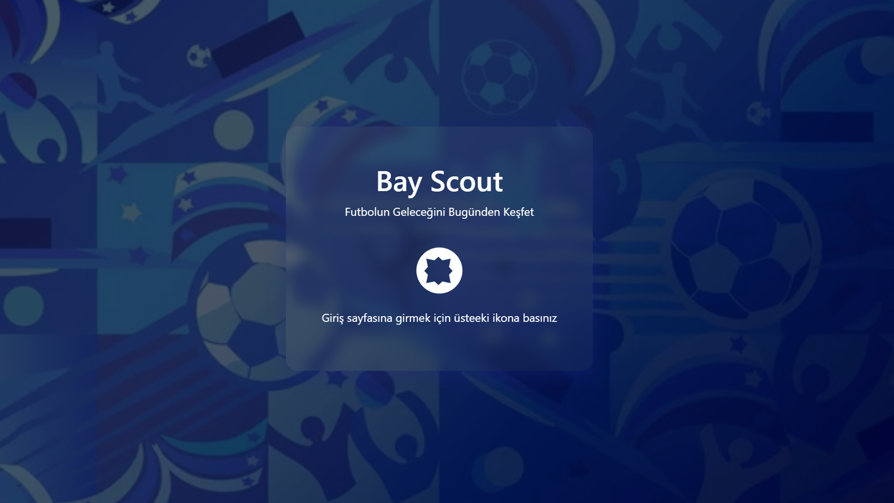
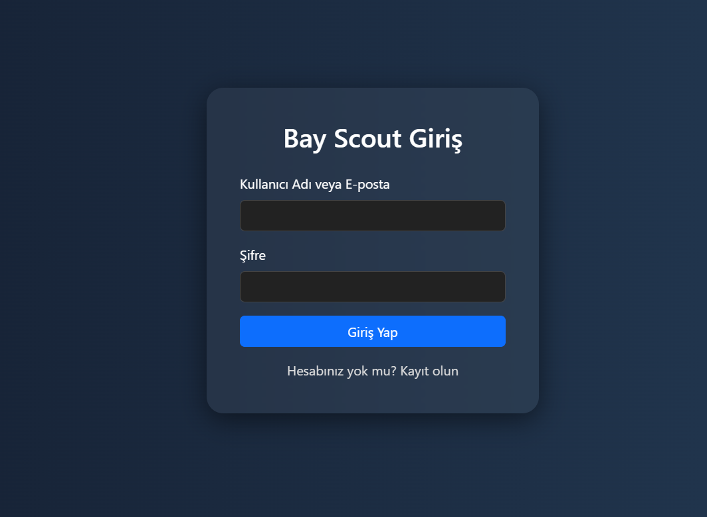
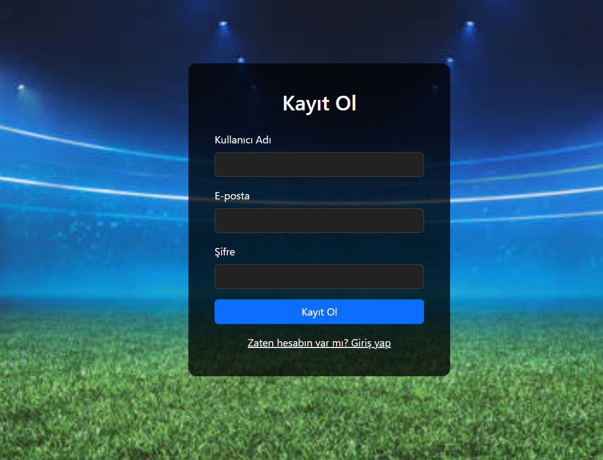
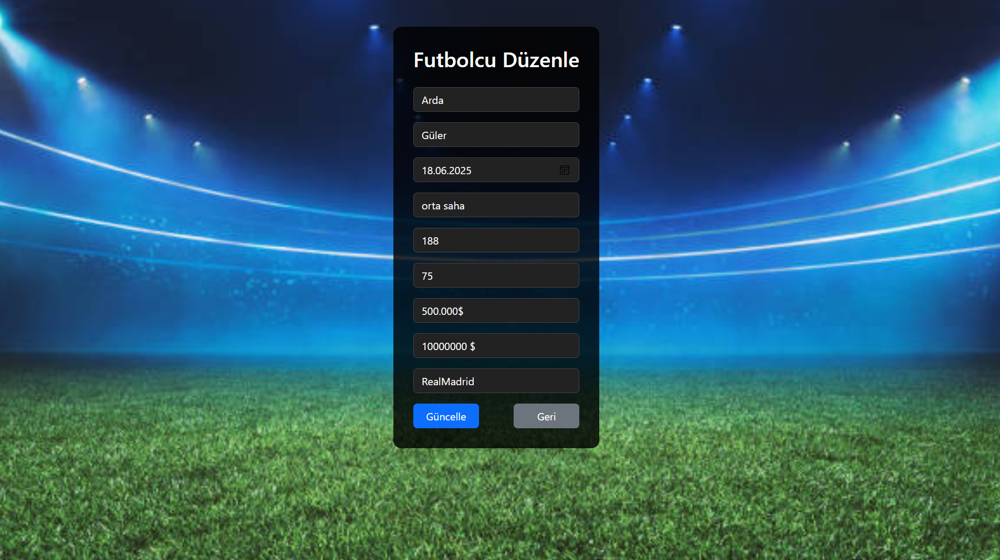
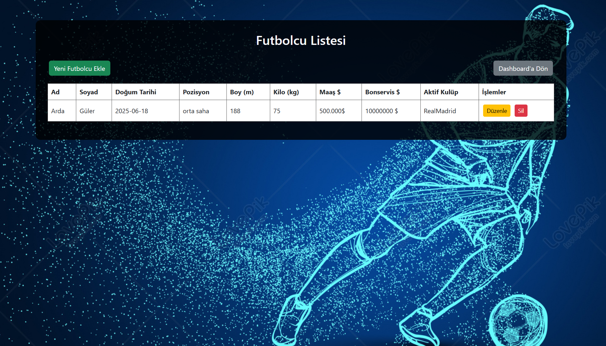
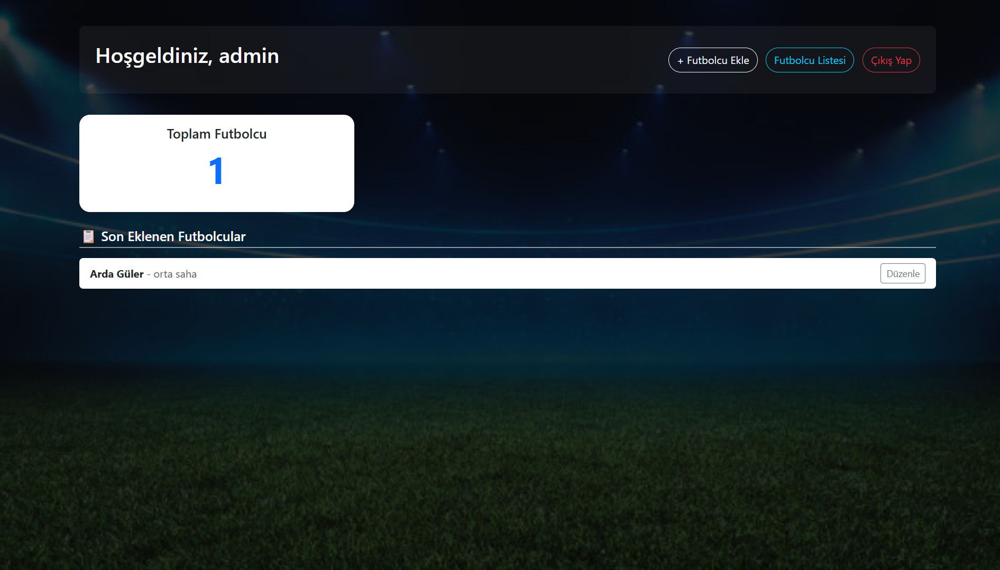

# 🏆 Bay Scout - Futbolcu Takip Uygulaması
Bu proje, PHP ve MySQL kullanarak geliştirilen bir **futbolcu izleme ve kayıt sistemidir**. Kullanıcılar sisteme üye olabilir, giriş yapabilir ve kendi futbolcu listelerini oluşturabilir



## 🚀 Özellikler
- ✅ Kullanıcı kaydı ve şifreli giriş (password_hash ile güvenli şifreleme)
- ✅ Oturum yönetimi (Session kullanımı)
- ✅ Futbolcu ekleme (Create)
- ✅ Futbolcu listesini görüntüleme (Read)
- ✅ Futbolcu bilgilerini düzenleme (Update)
- ✅ Futbolcu silme (Delete)
- ✅ Bootstrap ile responsive ve şık arayüz
## 📺 Tanıtım Videosu
 [YouTube Tanıtım Videosunu İzle](https://youtu.be/V9CZml_Q_xI)

## Veri Tabanı oluşturma

```sql
-- Veritabanını oluştur
CREATE DATABASE IF NOT EXISTS futbol_kulubu CHARACTER SET utf8mb4 COLLATE utf8mb4_unicode_ci;
USE futbol_kulubu;

-- Kullanıcılar tablosu
CREATE TABLE IF NOT EXISTS users (
    id INT AUTO_INCREMENT PRIMARY KEY,
    username VARCHAR(50) NOT NULL UNIQUE,
    email VARCHAR(100) NOT NULL UNIQUE,
    password VARCHAR(255) NOT NULL,
    created_at TIMESTAMP DEFAULT CURRENT_TIMESTAMP
);

-- Futbolcular tablosu
CREATE TABLE IF NOT EXISTS players (
    id INT AUTO_INCREMENT PRIMARY KEY,
    user_id INT NOT NULL,
    name VARCHAR(100) NOT NULL,
    surname VARCHAR(100) NOT NULL,
    birth_date DATE NOT NULL,
    position VARCHAR(50) NOT NULL,
    height FLOAT,
    weight FLOAT,
    salary VARCHAR(255),
    transfer_fee VARCHAR(255),
    active_club VARCHAR(255),
    created_at TIMESTAMP DEFAULT CURRENT_TIMESTAMP,
    FOREIGN KEY (user_id) REFERENCES users(id) ON DELETE CASCADE
);


## 💡 Detaylar
- Kullanıcı şifreleri **hashlenmiş şekilde** veritabanına kaydedilir.
- Oturumlar çerez değil, **PHP session** ile yönetilir.
- Projede **.htaccess** kullanılmamıştır .

### Oturum yönetimi


###  Futbolcu bilgilerini düzenleme 



### Futbolcu listesini görüntüleme (Read)



  ## 📂 Kullanılan Teknolojiler
- **PHP (yalın PHP, framework yok)**
- **MySQL (phpMyAdmin ile kolay kurulum)**
- **Bootstrap 5 (CSS kütüphanesi)**
- **JavaScript (basit doğrulamalar için)**
